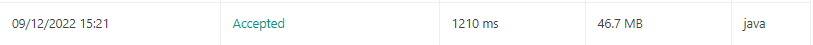
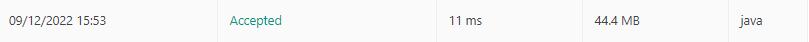
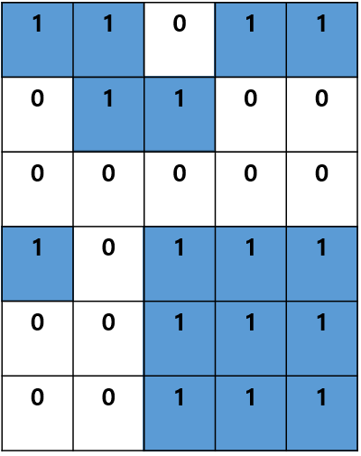
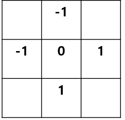

벌써 10번 째 알고리즘 스터디 회고록을 작성하게 되었습니다.

굳이 기념하자면 의미있는 횟수네요.

추석 연휴기간 동안 남들이 쉴 때 열심히 주야근무를 했습니다.

현재 하고 있는 일이 자기개발에 도움이되기때문에 아쉽거나 그러진 않았어요.<br /><br />
내가 지금 하고 있는 일(네트워크 관제)에서는 연휴란 없다라는 마인드로 내 나름대로 시간을 보낼 수 있는 재미있는 무언가를 찾았는데,

근무에 유용한 크롬 확장 플러그인을 개발해보자라는 생각이 번뜩 들었습니다.

근데 확장 플러그인이 생각보다 구조가 복잡해서 API 페이지 하나 열어두고 작업하는데 상당히 고역이었습니다. ( 제 역량부족을 다른 곳에 탓합니다.. )

결론적으로, 업무 중 하루의 적게는 2-3번, 많게는 열 댓번 해야하는 반복작업을 플러그인으로부터 자동수행하게 끔 처리하여 같이 근무하는 동료들이
조금 덜 부담을 가지고 편하게 수행할 수 있게 되어 상당히 뿌듯했습니다.

제가 개발자를 하는 이유에 나 또는 우리가 개발한 무언가로부터 누군가가 편리함과 좋은 경험을 느끼게 된다는게
큰 지분을 가지고 있는 것 같네요.

그럼 이어서 회고록 작성하겠습니다.
# 125. Valid PalinDrome ( LeetCode )

[Valid Palindrome](https://leetcode.com/problems/valid-palindrome/)

```java
  public boolean isPalindrome(String s) {
    s = s
            .toLowerCase()
            .replace(" ", "")
            .replaceAll("[^a-zA-Z0-9]", "");
    if (s.length() < 2) return true;
    System.out.println(s);
    int firstIndex = 0;
    int lastIndex = s.length() - 1;
    char first = s.charAt(firstIndex);
    char last = s.charAt(lastIndex);

    for (int i = 0; i < s.length() / 2; i++) {
      if (first != last) return false;
      first = s.charAt(++firstIndex);
      last = s.charAt(--lastIndex);
    }
    return true;
  }
```
해당문제는 단순해서 간단 명료하게 풀어낼 수 있었습니다.

하지만 채점 과정에서 거슬리던 점이 있었는데, 처음에 문자열 인자 값을 다음과 같이 수행하면서 꽤 많은
연산 수행시간을 거친다는 점입니다.
```java
    s = s
            .toLowerCase() // 모든 문자를 소문자로..
            .replace(" ", "") // 공백을 지운다.
            .replaceAll("[^a-zA-Z0-9]", ""); // 숫자나 문자가 아닌 문자를 정규식으로 필터링한다..
```
위와 같은 과정을 수행하고 나온 결과는 다음과 같습니다.



수행 시간이 1210ms 약 1.2초인데, 복잡한 요구사항이 있었던 것도 아니고 너무 많은 시간이 걸린 것 같아
다음과 같은 코드로 다시 작성하였습니다.

```java
  public boolean isFastDrome(String s) {
    s = s.toLowerCase().replace(" ", ""); // 위 과정에서 정규식 필터링만 제거하였다.
    int firstIdx = 0, lastIdx = s.length() - 1;

    while (firstIdx < lastIdx) {
      if (!Character.isLetterOrDigit(s.charAt(firstIdx)))
        firstIdx++;
      else if (!Character.isLetterOrDigit(s.charAt(lastIdx)))
        lastIdx--;
      else if (s.charAt(firstIdx) != s.charAt(lastIdx)) {
        return false;
      } else {
        firstIdx++; lastIdx--;
      }
    }
```
실행 결과


다음 코드는 문자가 기호값이 있다면 인덱스를 한칸 밀어버리고(해당 인덱스 무시) palindrome 형태인 지
검사하게 됩니다.

자바에서 Character 객체에서 isLetterOrDigit 이라는 편리한 정적 메서드를 제공하여 
정규식 필터링 또는 별도의 검증 로직 작성 없이 빠르고 쉽게 구현할 수 있었습니다.

***
# 2828. 사과 담기 게임 ( BOJ )
[사과담기 게임](https://www.acmicpc.net/problem/2828)
```Java
public class Main {

  public static void main(String[] args) throws IOException {

    BufferedReader br = new BufferedReader(new InputStreamReader(System.in));

    StringTokenizer st = new StringTokenizer(br.readLine(), " ");

    st.nextToken();
    int bagSize = Integer.parseInt(st.nextToken());
    int sum = 0;
    int left = 1;
    int right = bagSize;
    int appleDropCount = Integer.parseInt(br.readLine());

    for (int i = 0; i < appleDropCount; i++) {
      int where = Integer.parseInt(br.readLine());

      if (left <= where && right >= where) continue;
      else if (left > where) {
        sum += left - where;
        right -= left - where;
        left = where;
      } else {
        sum += where - right;
        left += where - right;
        right = where;
      }

    }

    System.out.println(sum);
  }

}
```
바구니는 처음에 왼쪽 맨 끝에 위치하기 때문에 다음과 같이 사이즈를 규정하였습니다.
```Java
    ...
    int left = 1;
    int right = bagSize; // 바구니 크기 
    ...
```

for 문 안에서 사과가 떨어지는 3가지 분기를 작성하였습니다.
1. 사과가 바구니 범위 안으로 떨어졌을 때
2. 사과가 바구니의 왼쪽에 가깝게 떨어졌을 때
3. 사과가 바구니의 오른쪽에 가깝게 떨어졌을 때

사과가 만약 왼쪽바구니쪽으로 떨어졌다면...
```Java
    sum += left - where; // 왼쪽으로 이동한 횟수만큼 +연산
    right -= left - where; // 왼쪽으로 이동한 횟수만큼 -연산. 해주지 않으면 바구니는 왼쪽으로 늘어나기만하는 기이한 형태가 된다.
    left = where; // 떨어진곳에 바구니의 왼쪽이 도달하도록 설정
```
우측도 이와같은 원리로 해결하였습니다.

# 1926. 그림 ( BOJ )
[그림](https://www.acmicpc.net/problem/1926)
```Java
class Pair {
  public int x, y;
  public Pair(int x, int y) {
    this.x = x;
    this.y = y;
  }
  int getX() { return x; }
  int getY() { return y; }
}

public class Main {

  public static void main(String[] args) throws IOException {

    BufferedReader br = new BufferedReader(new InputStreamReader(System.in));
    StringTokenizer st = new StringTokenizer(br.readLine(), " ");
    Queue<Pair> q = new LinkedList<>();

    int h = parseInt(st.nextToken());
    int w = parseInt(st.nextToken());
    int[][] canvas = new int[h][w];

    for (int i = 0; i < h; i++) {
      st = new StringTokenizer(br.readLine(), " ");
      for (int j = 0; j < w; j++)
        canvas[i][j] = parseInt(st.nextToken());
    }

    boolean[][] visited = new boolean[h][w];
    int paintCount = 0;
    int area = 0;
    int max = 0;
    int[] dx = { 0, 0, -1, 1 };
    int[] dy = { -1, 1, 0, 0 };

    for (int i = 0; i < h; i++) {
      for (int j = 0; j < w; j++) {
        if (canvas[i][j] == 0 || visited[i][j]) continue;
        paintCount++;
        q.offer(new Pair(i, j));
        visited[i][j] = true;
        area = 0;
        while (!q.isEmpty()) {
          Pair p = q.poll();
          area++;
          for (int k = 0; k < 4; k++) {
            int x = p.x + dx[k];
            int y = p.y + dy[k];
            if (x < 0 || x >= h || y < 0 || y >= w)
              continue;
            if (canvas[x][y] == 1 && !visited[x][y]) {
              q.offer(new Pair(x, y));
              visited[x][y] = true;
            }
          }
        }
        if (area > max) max = area;
      }
    }

    System.out.println(paintCount);
    System.out.println(max);
  }

}
```
지금까지 해결했던 문제 중에 가장 코드가 기네요.<br />
해당 문제는 BFS 의 기본적인 이해와 함께 공부하면서 크게 도움되었던 문제입니다. <br />
문제를 해결하면서 BFS 의 탐색 원리와 알고리즘 구조 이해를 파악하였습니다.

문제와 해당 코드 구조에 대해 하나씩 차근차근 분석해보겠습니다.

일단 문제의 요구사항은 다음과 같습니다.<br/><br/>
1. 사이즈가 정의된 캔버스에서 그림의 갯수는 몇 개인가?
2. 너비가 가장 큰 그림의 너비는?

<br />
일단 필요한 값들을 입력받고 그려진 캔버스의 예제는 다음과 같습니다.<br/>



그림에서 확인할 수 있듯이 0이 비어있는 캔버스 영역이고, 1이 그림이 존재하는 영역이며, 위 예제에서는
그림은 총 4장, 가장 큰 그림의 너비는 9입니다.

문제를 해결하기 위해 선언한 변수는 다음과 같습니다.
```Java
    boolean[][] visited = new boolean[h][w]; // 방문 여부 체크
    int paintCount = 0; // 총 그림 갯수
    int area = 0; // 탐색 중인 그림의 너비
    int max = 0; // 그림의 최대 너비
    int[] dx = { 0, 0, -1, 1 }; // 배열의 좌, 우
    int[] dy = { -1, 1, 0, 0 }; // 배열의 상, 하
```
visited 는 캔버스에서 너비 우선 탐색을 수행하면서 방문한 칸의 여부를 확인하기 위해 존재합니다.

area 는 탐색 중인 그림의 너비를 확인하는데, 매번 한 그림의 너비탐색을 끝나면 max와 비교하여 max 값을 갱신합니다.
```Java
 if (area > max) max = area;
```
dx, dy 가 처음에는 잘 이해안될 수도 있는데 단순히 상하좌우 좌표값을 의미하며, 상대적인 좌표값 기준에서 상하좌우 값
방문을 위해 존재합니다.



다음은 탐색 알고리즘입니다.
```Java
    for (int i = 0; i < h; i++) {
      for (int j = 0; j < w; j++) {
        if (canvas[i][j] == 0 || visited[i][j]) continue;
        paintCount++;
        q.offer(new Pair(i, j));
        visited[i][j] = true;
        area = 0;
        while (!q.isEmpty()) {
          Pair p = q.poll();
          area++;
          for (int k = 0; k < 4; k++) {
            int x = p.x + dx[k];
            int y = p.y + dy[k];
            if (x < 0 || x >= h || y < 0 || y >= w)
              continue;
            if (canvas[x][y] == 1 && !visited[x][y]) {
              q.offer(new Pair(x, y));
              visited[x][y] = true;
            }
          }
        }
        if (area > max) max = area;
      }
    }

```

방문했다면 탐색하지 않고, 한 좌표 기준으로 주변 좌표에 그림이 있다면 없을 때까지(while문) 좌표를
탐색하며 상태를 기록합니다. ( 방문 여부, 너비값 등.. )

모든 방문을 마치고 최종적으로 문제에서 요구했던 그림의 갯수와 최대 너비 값을 구할 수 있게 됩니다.

# 끝마치며..

매 주 미루다가 드디어 BFS 에 도전해보았습니다. 이론은 이해됬는데 막상 구현하려니 매우 번거로워 그동안 미루게되었던 것 같습니다.

그래도 계속 도전하면서 문제를 해결할 수 있었어서 매우 뿌듯한 한 주였습니다. 😁


***
# Reference
[Java Reference - Character](https://docs.oracle.com/javase/7/docs/api/java/lang/Character.html)

[[파이썬, 자바] BOJ_2828(사과 담기 게임) - 딱따구르리](https://buzz-program.tistory.com/entry/%ED%8C%8C%EC%9D%B4%EC%8D%AC-BOJ2828%EC%82%AC%EA%B3%BC-%EB%8B%B4%EA%B8%B0-%EA%B2%8C%EC%9E%84)

[백준 1926번 그림(JAVA) 문제 풀이](https://iseunghan.tistory.com/311)

[[알고리즘] 너비 우선 탐색(BFS)이란](https://gmlwjd9405.github.io/2018/08/15/algorithm-bfs.html)
