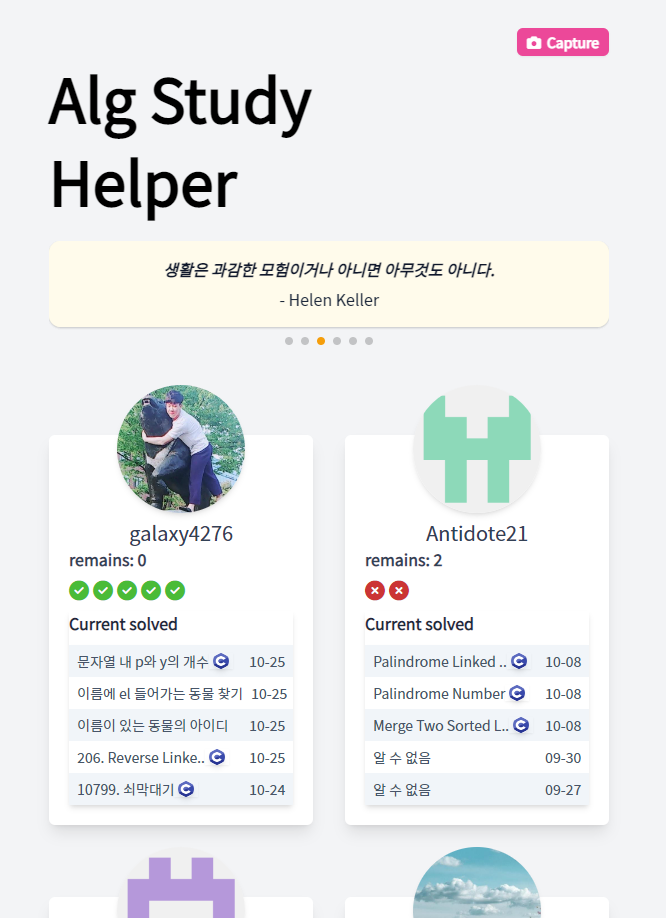
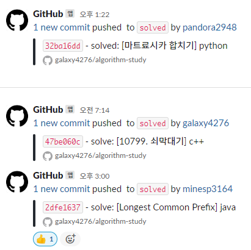
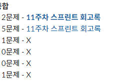
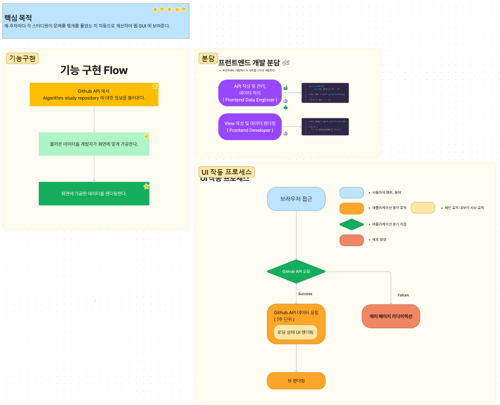
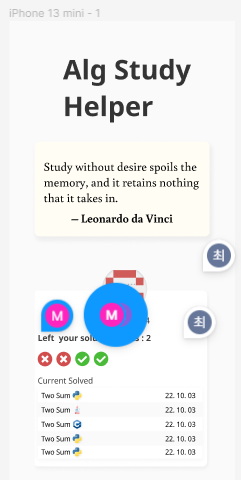

# 서비스 간단 소개

[서비스 페이지 이동](https://alg-study-helper-chi.vercel.app/)
> 현재 개발되어 운영중인 스터디 웹서비스..

매우 간단하고 직관적인 페이지 1개짜리 웹서비스이다.
간단하게 스터디 구성원들이 풀어야할 목표갯수를 몇 개 해결하였고, 최근에 푼 문제에 대해 문제 이름,  사용언어, 
문제 해결 날짜를 표기한다.

### 서비스를 개발하게 된 계기
매 주마다 주어진 문제 갯수를 해결하는 방식으로 알고리즘 스터디가 진행 중인데, 해결한 문제를 특정 브랜치에
커밋푸시하면 팀원 전체에게 해당 문제를 해결했다는 알림이 가게 끔 자동화되어 있다.

해당 알림의 목적은 크게 두 가지인데 다음과 같다.
1. 스터디 구성원들에게 알고리즘 문제를 해결하는데 있어 동기 부여
2. 스터디 진행 간 한 주가 끝날 시점에 문제를 정산하기 위함

문제를 정산한다는 말은 현재 필자가 스터디장으로써 각 인원마다 몇 문제를 해결하였고 정해진 풀이 갯수를 도달하였는 지 체크하고
종합하여 전체 메시지에 알리는 것이다.


여기서 다음과 같은 문제가 발생한다.
1. 팀원들이 문제를 해결 중 임을 알 수는 있으나, 한눈에 구체적으로 파악하기 어려움
동기부여 측면에서도, 관리 측면에서도 최소 기능을 원활하게 수행하지 못한 다는 점이다.

그러므로 최소한의 정보로 한 눈에 스터디 진행현황을 파악할 수 있는 서비스를 개발해야겠다고 다짐했다.

# 서비스가 기획되었던 과정
일단 서비스의 핵심목적을 도출하고 2인에서 진행하기에 각 인원이 분담할 업무를 지정하고 애플리케이션 흐름을
간단하게 피그잼에 표현했다.

[피그잼 화면 살펴보기](https://www.figma.com/file/t2fKIyhvfceTg9YZrB8A4F/minesp-algo-study-figjam?node-id=0%3A1)

필자가 맡은 역할에 따라 수행해야 할일은 간추려서 다음과 같다.
- 프로젝트 개발환경 구성 및 엔지니어링 ( Webpack5, React.js with typescript )
- Github API 을 활용하여 데이터를 가공하여 뷰 담당 개발자에게 전달하기
- UI 디자인 업무 수행 ( 공통 )

전체적인 틀이 갖춰지고 현장에서 어느정도 의견을 수립하고 나서 바로 피그마에서 디자인을 수행했다.
가능하면 한 눈에 10개 이하의 정보로 현황을 파악할 수 있게 끔 신경썼다.

[피그마 화면 살펴보기](https://www.figma.com/file/qSeRdfRsrlyKHmXH9MvLOY/minesp-algo-study-figma?node-id=0%3A1)

지금부터는 서비스 개발단계를 진입하고나서, 어떻게하면 같이 협업하는 개발자분과 원활하게 소통하면서 효율적으로
업무를 수행할 지 고민했었던 경험을 서술하겠다.

# 어떻게해야 View 담당자에게 쉽고 직관적인 데이터구조를 전달할 수 있을까?
이 부분이 가장 고민이 많았고 그랬던 만큼 지금와서 되돌아보니 가장 재밌었던 것 같다.
Github API 에서 Commit 리스트를 응답하는 스키마의 구조를 뷰 개발자에게
이 부분에서는 이렇게이렇게하면되요 라고 장황하게 문서를 남기고 싶지않았다.

딱 보면 한 눈에 "아 이렇게 하면 되는군" 싶을정도로 직관적이게 데이터를 조작하고 싶었고 그 때 당시 상황에서
그럴 수 있을거라 확신이 들었다.

API 를 요청하고 응답받는 코드의 핵심은 다음과 같다.
```typescript
/**
 * @desc 모든 사용자 브랜치명 기준으로 각각 커밋리스트 요청의 비동기 수행(Promise.all) 을  반환합니다.
 */
export const getAllUserCommittedList = () => {
  const promises: Promise<{[p: string]: GithubCommitResponse[]}>[] =
    userList.map(getUserCommittedListJson);
  return Promise.all(promises);
};
```
다음과 같은 코드는 뷰 개발자가 바로 받아서 사용하기에 다음과 같은 문제가 있을 것이라 생각하였다.
1. 배열 응답데이터에서 대응하는 유저 정보를 인덱스로 받아와야 함.
2. 해당 api 코드를 React.js의 렌더링시스템에서 비효율적이지 않게 고려해서 사용해야 함.
3. 상위 컴포넌트에서 받아온다면 prop drilling 되는 범위를 고려해야 함.

1번 문제가 꼭 나쁜 것은 아니다. 오히려 최적화 관점에서는 훌룡할지도 모르겠다.

하지만 좀 더 휴머니즘이 녹아들어간 코드를 욕심냈기때문에 다음과 같은
변환 과정을 거치게 되었다.
```typescript
/**
 * @desc 스터디가 진행되는 주(최근 1주)내에 해결된 문제인 지 검사합니다.
 */
export const isSolvedCurrentSprint = (date: string) => {
  const commitDate = new Date(date);
  const beginDate = getBeginningOfWeekDate();
  const endDate = getBeginningOfWeekDate();
  const sprintEndDate = new Date(endDate.setDate(beginDate.getDate() + 6));
  return (commitDate >= beginDate && commitDate <= sprintEndDate);
};

type CommittedData = {
  [p: string]: GithubCommitResponse[];
}

class CommittedListMapper {
  private userCommitListTable: Map<userListType, GithubCommitResponse[]> = new Map();
  private userSolvedCountTable: Map<userListType, number> = new Map();

  constructor(data: CommittedData[]) {
    data.forEach(userObject => {
      const userBranchName = Object.keys(userObject)[0] as userListType;
      const commitData = Object.values(userObject)[0];
      this.userCommitListTable.set(userBranchName, commitData);
      const solvedCount = commitData
        .filter(({ commit: { author: { date } } }) => isSolvedCurrentSprint(date))
        .length;
      this.userSolvedCountTable.set(userBranchName, solvedCount);
    });
  }

  public getUserCommittedTable() { return this.userCommitListTable; }

  public getUserSolvedTable() { return this.userSolvedCountTable; }

  public getUserCommittedList(user: userListType) {
    return this.userCommitListTable.get(user) as GithubCommitResponse[];
  }

  public getUserSolvedCount(user: userListType) {
    return this.userSolvedCountTable.get(user) as number;
  }
}

export default CommittedListMapper;

```
View 담당자가 구성원 이름만 넣으면 원하는 데이터를 뽑을 수 있다는 사실 외 것들을 몰라도 되는 정도로 코드를
추상화 하였고 다음과 같이 동작한다.

```typescript
// 해당 사용자의 이번 진행기간 내 풀이한 문제 갯수를 가져온다.
api.getUserSolvedCount('galaxy4276');
// 해당 사용자의 커밋 리스트 객체 배열을 반환한다.
api.getUserCommittedTable('galaxy4276');
```
해결한 문제에 대한 정보와 커밋 리스트는 사용하는 데이터 컴포넌트가 다르므로 분리하였다.

이제 여기서 한 발자국 더 나아가서 해당 api 데이터를 관리하는 React Custom Hook 을 작성하였다.
```tsx

const CommittedListContext = createContext<HookProps>({
  factory: new CommittedListMapper([]),
  isLoading: true,
});


/**
 * @desc CommittedListContext 의 Consumer hook 입니다.
 */
const useCommittedListContext = () =>
   useContext(CommittedListContext);


/**
 * @desc 모든 사용자의 최신일 순 Commit 데이터를 가져옵니다.
 */
const useFetchGithubApi = () => {
  const [isLoading, setIsLoading] = useState<boolean>(true);
  const [factory, setFactory] = useState<CommittedListMapper>(
    new CommittedListMapper([])
  );

  useLayoutEffect(() => {
    (async () => {
      setIsLoading(true);
      const userCommittedList = await getAllUserCommittedList();
      setFactory(new CommittedListMapper(userCommittedList));
      setIsLoading(false);
    })();
  }, []);

  return {
    factory,
    isLoading,
  };
};
```
해당 훅을 또 커스텀 훅으로 감싸서 View 개발에 필요한 정보만을 꺼내갈 수 있도록 하였다.
```typescript
/**
 * @desc useFetchGithubApi 의 반환값과 Context Provider 컴포넌트를 제공합니다.
 */
const useCommittedList = () => {
  const state = useFetchGithubApi();
  return {
    Provider: CommittedListContext.Provider,
    ...state,
  };
};

export default useCommittedList;
```

이제 React.js 코드에서 다음과 같이 사용하면 되는 것이다.
```tsx
// 최상위 컴포넌트
const RootConfiguration: React.FC<PropsWithChildren> = ({ children }) => {
  const { Provider: CommittedListProvider, ...state } = useCommittedList();

  return (
    <CommittedListProvider value={state}>
      { children }
      </CommittedListProvider>
  );
};
```
```tsx
// 사용자 프로필 리스트를 렌더링하는 컴포넌트
export const ProfileList: React.FC = () => {
  const { factory, isLoading } = useCommittedListContext();


  const allUserCommittedLists = useMemo(() =>
    userList.map((userBranchName => factory.getUserCommittedList(userBranchName)))
    , [isLoading]);

  if (isLoading || !factory)
    return (
      <ProfileLayout>
        { getFillMeaninglessArray(6).map(() => <ProfileLoading key={nanoid()} />) }
      </ProfileLayout>
    )
...
return (...);
```
# React 에서 Prop Drilling 을 방지하자
컴포넌트가 추상화되면 불가피하게 prop drilling 을 할 수 밖에 없기 마련이다.
Github Commit API 스키마가 간단한 편은아닌데 어떤 데이터는 여기로, 어떤 데이터는 저기로 prop을 내려주는 만큼
개발자는 피곤하고 가독성도 떨어지기 마련이다.

처음에 그런식으로 코딩되었던 부분을 추 후 Context API를 사용하여 해결했다.
```tsx
// Before..
return (
  <ProfileLayout>
    {
      allUserCommittedLists.map(
        (committedList, index) =>
          <Profile
            key={nanoid()}
            data={committedList}
            solvedCount={solvedCountList[index]}
        />
        )
    }
  </ProfileLayout>
);
```
```tsx
// after
return (
  <ProfileLayout id="profile-capture">
    {
      allUserCommittedLists.map(
        (committedList) => (
          <UserCommitListContext.Provider
            value={committedList}
            key={nanoid()}
          >
            <Profile />
          </UserCommitListContext.Provider>
        )
      )
}
</ProfileLayout>
);
```
이렇게 Context API의 Provider 를 적용해놓으면 하위 컴포넌트 어디서든 value 데이터를 꺼내 쓸 수 있다.
```tsx
export const Profile: React.FC = () => {
	const commitList = useUserCommitList(); // <- 편하게 꺼내쓰면 됩니다.
	const { author } = commitList[0];

	const onClickOpenUserProfile = () =>
	 window.open(author.htmlUrl);

	return (
		<article className="my-5 p-5 shadow-lg rounded-md flex flex-col w-full bg-white relative">
			<Avatar url={author.avatarUrl} />
				<span
					onClick={onClickOpenUserProfile}
					className="
						pt-16 self-center text-slate-700 text-xl cursor-pointer
						hover:text-cyan-500 transition
				">
					{ author.login }
				</span>
			<div className="Stiker flex" />
			<Goals
				username={author.login as keyof typeof algStudyUserInfo}
			/>
			<Problem />
		</article>
	);
};

```

# 개발하고나서 느낀 점
늘 프로젝트를 진행하면 백엔드 포지션으로 했었는데 처음으로 프런트엔드 영역에서 크게 활약할 수 있어서 개운했다.
데이터 관점에서 어떻게 해야 편하고 직관적이게 데이터를 전달할 수 있을 지 고민할 수 있어서 정말 뜻깊은 경험이었다.
구성이 간단하기도 하고 백엔드가 없는 만큼 어려운 프로젝트는 아니었지만 React.js 관점에서 최적화를 고민하고,
Webpack 5을 활용해서 처음으로 외부도움없이 (Next.js 같은..) 프런트엔드 엔지니어링을 수행해볼 수 있어서 좋았다.

간단하지만 고민많았던 서비스를 개발하면서 내가 더 다방면하게 알아야할 것이 무엇인 지 느꼈던 것 같다.

언제 쯤 어딜가던 막힘없는 개발자가 될 수 있을까

아직은 먼 욕심인 것 같다.

