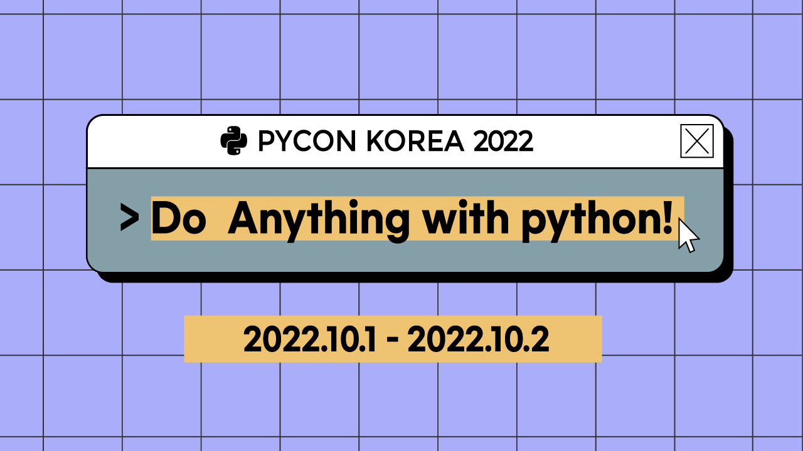
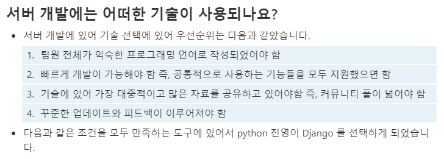
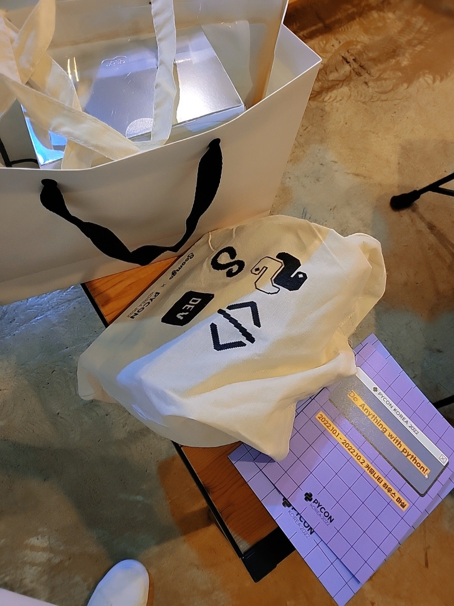
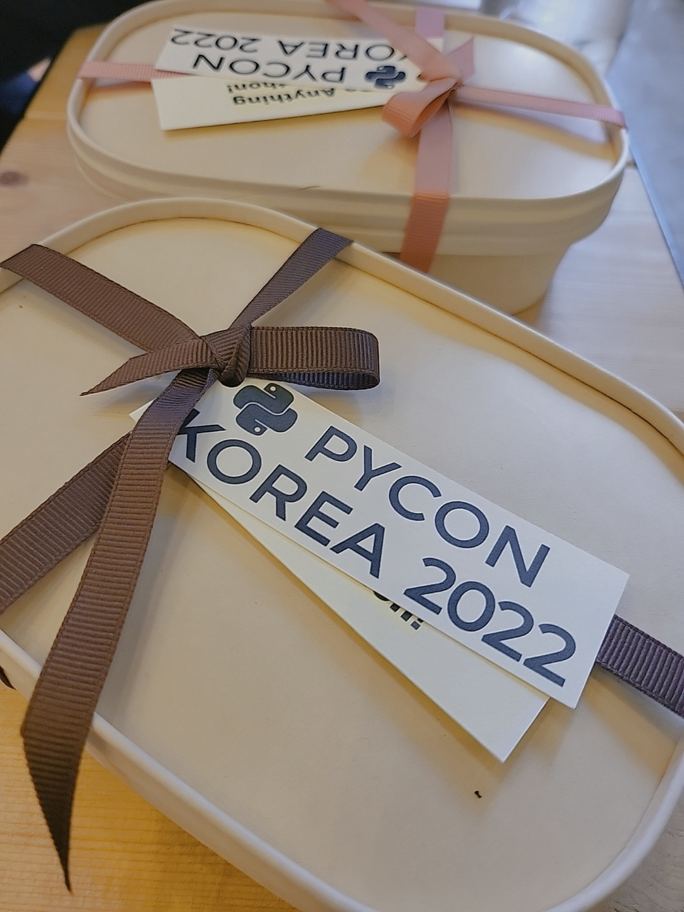
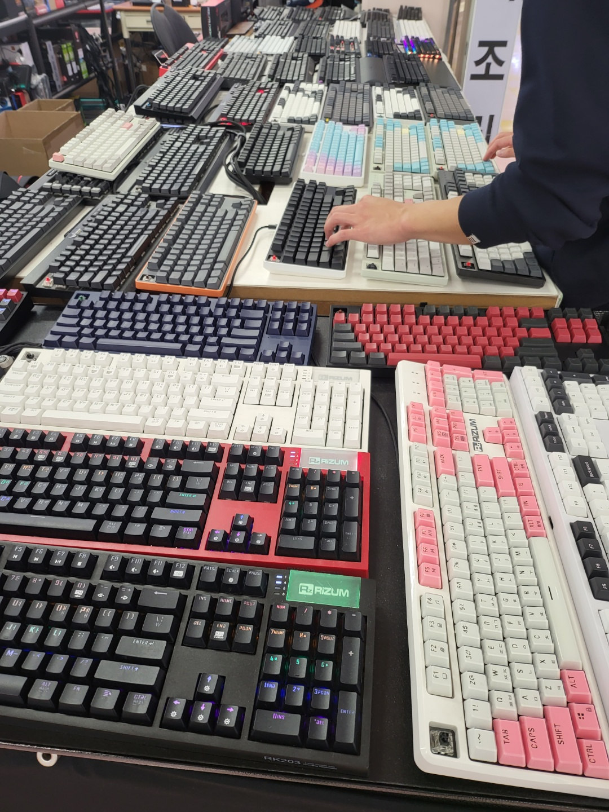

# PYCON 2022 참여 계기

나는 원래 파이썬이라는 언어는 거의 사용하지 않았다

타입이 명확한 정적 언어를 선호하고 주로 웹개발을 하다보니 Typescript 나 
Java 위주로 프로그래밍 언어를 사용해 왔다.

그러다 우연히 파이썬을 접했는데, 특정 시간마다 느리고 지루한 웹 서비스에 보고를 작성하는
정말 숨이 턱막히는 업무를 자동화해놓고 싶었는데 마침 그동안 들어왔던 파이썬의 명성이 떠올라서 바로
키보드에 손을 얹었다.

단순히 내장 request 모듈과 BeautifulSoup4 만을 사용했을 뿐인 데, 언어에 익숙하지 않아 좀 헤맬 것이라
생각했거늘 정말 빠르고 쉽게 스크립트를 작성할 수 있었다.

이렇게 한 번 멋진 파이썬의 매력을 잠시 경험하고, 신규 주니어 프로젝트에 Project Manager 로 투입되었는데,

나를 제외한 모든 팀원들이 익숙한 언어가 또..

> 파이썬 또 너야...

시간이 중요한 프로젝트였기 때문에 나는 어쩔 수 없이 서버개발 언어를 파이썬으로 선정하였고

해당 언어의 생태계를 조사하던 중 Django 가 이상적이다 판단하여 결정하였고 즉시 해당 프레임워크를
공부와 동시에 코드를 작성해야만 했다.

> Notion 팀 문서 내용 ( 기술문서를 작성하는데 있어 부족한 점이 많다.. )

여기까지 나와 파이썬이 인연이 계속되었고 휴가를 준비하고 있었는데 마침 휴가 첫 날부터 파이콘이
에정되어 있던 것이다.

이번 파이콘 섹션에는 Django 관련 내용이 많았는데 그 점이 맘에 들었고, 파이썬에 대해 좀 더 알아갈 수
있는 섹션들을 들어야겠다고 생각이 들어
바로 내용을 확인하고 친구한테 말하고 빠르게 티켓을 예매했다.

토요일 일정은 휴가 당일이어서 무리가 있어 일요일에 참석하기로 했다.
(RenPy 개발 경험 들어보고 싶었는데 아쉽다 ㅋㅋ)

# PYCON 2022 후기

첫 입장부터 뭔가 이것저것 많이주셔서 놀랐다.

티셔츠는 사전에 구매걸어놔야 받는 줄 알았는데 기본으로 정말 귀여운 고양이코딩(?) 티셔츠를 주셨다.

나는 여기서부터 이미 참여하기 위해 투자한 돈과 시간에 대해 만족스러웠다.

아래 참여하면서 가장 기억에 남았던 것들에 대해 기술하였다.

# Section

처음들었던 섹션에서 기존 VB 레거시를 파이썬으로 대체하고 개발자가 아닌 분들도 함께 코드에 참여하여
지속적인 유지보수를 통해 좋은 경험을 이루어냈던 이야기였는데, 정말 컴퓨터에서 low 한 영역까지도
파이썬으로 작업이 가능하다는 점이 놀라웠다.

보통 OS의 Native한 영역은 c/c++ 언어를 사용하여 작업하지 않는가? ( 필자의 틀에 박힌 생각일 수 있다. )

운영체제 작업부터 스케줄링, 웹 크롤링 등 모든 영역을 모듈화하여 파이썬으로 작업하고 언어 특성 상

굉장히 넓은 생태계 (다양한 라이브러리) 와 쉬운 코드 작성에 의해 마치 마법같이 개발되던 과정을 듣고 나니

요즘 개발자들에게 파이썬은 필수가 아닌가 싶다. ( 물론 분야에 따라 접할 일이 없기도 하다. )

강사님께서 해주신 말씀 중에 이 내용이 가장 인상 깊었다.

> 일단 개발할 영역에서 라이브러리를 검색해보고 있으면 50% 는 성공이다!

필자는 npm 생태게를 많이 접하므로 "아 그렇지" 라는 감탄사가 내부에서 울렸다.

# Gift

강연을 듣고 다양한 개발자분들이 토론하는 걸 멀리서 신기하듯 구경하다보니 점심시간이 되어 받은
스낵 박스다.

아기자기한 포장과 디저트 구성이 정말 운영진분들이 열심히 준비하셨구나 싶다.

# Community

시간이 얼마 흘러가고 멍하게 서있으니 유명한 기업에서 나오신 분께서 회사에 대해 소개해주셨다.

사내 개발 문화에 대해서 자세히 설명해주시고 협업에 대해 흥미있는 내용을 열심히 설명해주셨는데 

PYCON 에서 가장 값 진 경험이 아닐까 싶다.

필자랑 참여한 친구는 군인/학생 듀오임을 설명드렸는데 불구하고 정말 열심히 설명해주시고 많이 알려주셨고,

사무실 체험까지 권유해주셔서 정말 감사드렸다.

이 내용이 가장 기억에 남아 파이콘이 끝나고, 주변에 개발자를 준비하는 친구에게 팜플렛을 가져가서

들었던 내용을 열심히 설명했다. 

나는 이러한 경험이 예비개발자가 협업에 대해 긍정적인 기운을 얻고 활기차게 준비할 수 있는 계기가 되지 않나 싶다.

# 아쉬운 점

2019년에는 강연이 오프라인에서 강사분들께서 직접 해주셨던거로 기억하는데, 유투브 영상 공개라 조금 아쉬웠다.

# END
정말 다양한 개발자분들이 오시고 본인의 다양한 경험과 기술적인 내용을 공유하시는 장면들을 보았는데,
필자는 아직 많이 미숙한 학생이고 기술적인 내용을 질문드리기에도 아직 파이썬 생태계에서는

질문을 해도 무슨 질문을 어떻게 해야할 지 모르는 수준이라 많이 아쉬웠다.

가령, 파이썬에서 asyncio 처럼 비동기 작업이 장고에서 어떻게 쓰이고 작동하는 지..이런 기술적인 질문또한 허용이 되는지 모르겠다.

구글링하면 바로 나오기도하고 너무 기술적인 질문이라 흐름을 깨진 않을 지 아니면 단순히 내가 너무
내성적인 건지 모르겠다.

앞으로도 열심히 공부하고 Django 로 애플리케이션을 개발하는 경험을 통해 나도 파이썬 좀 알아 정도로
성장했으면 싶고 결과적으로 나의 성장을 위한 좋은 지표가 되었던 것 같다.

> PYCON 진행 시간 중 여유 시간이 있어 다녀온 테크노마트 타건샵

    